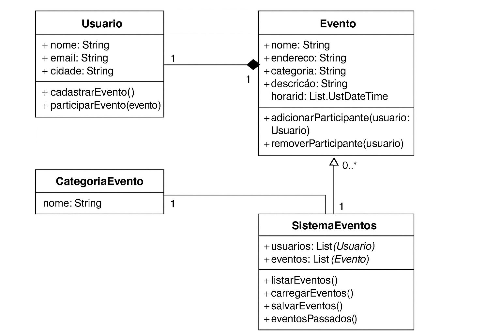

# 📅 Sistema de Cadastro e Notificação de Eventos

Este projeto é um sistema em Java desenvolvido com o objetivo de cadastrar, listar, visualizar e notificar eventos que estão ocorrendo na cidade do usuário. O sistema é baseado no paradigma da programação orientada a objetos.

## 🧩 Funcionalidades

- Cadastro de usuários
- Criação de eventos com atributos: nome, endereço, categoria, horário e descrição
- Definição de categorias de eventos (ex: festas, shows, esportivos)
- Listagem de eventos futuros
- Listagem de eventos passados
- Participação e cancelamento de eventos
- Visualização dos eventos com presença confirmada
- Ordenação dos eventos por data/hora
- Salvamento e carregamento de dados em arquivo `events.data`

## 💡 Requisitos

- Java 8 ou superior
- IDE recomendada: Eclipse, NetBeans ou Replit
- Estrutura orientada a objetos
- Projeto rodando em Console
- Utilização de arquivos `.data` para persistência simples dos dados

## 📂 Estrutura do Projeto

```
/src
  ├── models/
  │   ├── Usuario.java
  │   ├── Evento.java
  │   ├── CategoriaEvento.java
  ├── controllers/
  │   └── SistemaEventos.java
  ├── Main.java
events.data
README.md
```

## 🧭 Como Executar

1. Clone o repositório:
   ```bash
   git clone https://github.com/seu-usuario/nome-do-repositorio.git
   ```

2. Importe o projeto em sua IDE de preferência.

3. Execute a classe `Main.java` para iniciar o programa no console.

## 📌 Observações

- O sistema carrega automaticamente os eventos salvos no arquivo `events.data` ao iniciar.
- Ao sair, todos os eventos e usuários são persistidos nesse mesmo arquivo.
- Recomenda-se o uso da classe `LocalDateTime` para manipulação de datas.

## 🛠️ Tecnologias Utilizadas

- Java
- Orientação a Objetos
- Manipulação de Arquivos (I/O)
- Listas e Coleções Java

## 📎 Diagrama de Classes

O sistema foi modelado com base no seguinte diagrama de classes:




Desenvolvido como parte da atividade prática da Unidade Curricular de Imersão Digital 🎓
